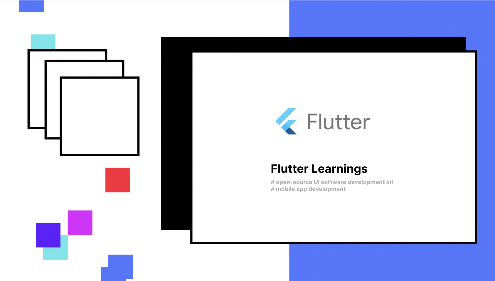

# Flutter Learnings

A-Z flutter learning project.

## Getting Started

1. Main.dart
2. Scaffold Widget
3. AppBar
4. Container Widget
5. Row Vs. Column
6. Stateful Vs. Stateless
7. Routes(Navigations)
8. ListView & ListTile
9. TextFeild Widget
10. Flutter Form
11. Asynchronous Programming
12. Future API
13. Stream & StreamBuilder
14. State Management
15. Provider Package
16. MVVM Vs. Bloc

